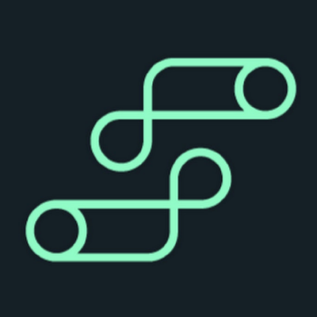

<p align="center">
   
</p>

<p align="center">
  Artwork by <a href="https://twitter.com/ashleymcnamara">Ashley McNamara</a><br/>
  Inspired by <a href="http://reneefrench.blogspot.co.uk/">Renee French</a><br/>
  Taken from <a href="https://gopherize.me">https://gopherize.me</a> by <a href="https://twitter.com/matryer">Mat Ryer</a>
</p>

<h1 align="center">OPC/UA</h1>

A native Go implementation of the OPC/UA Binary Protocol.

We support the current and previous major Go release.
See below for a list of [Tested Platforms](#tested-platforms) and [Supported Features](#supported-features).

[](https://github.com/gopcua/opcua/actions)
[](https://pkg.go.dev/github.com/gopcua/opcua)
[](https://github.com/gopcua/opcua/blob/master/LICENSE)
[](https://github.com/gopcua/opcua/releases)

## Quickstart

```sh
# install library
go get -u github.com/gopcua/opcua

# get current date and time 'ns=0;i=2258'
go run examples/datetime/datetime.go -endpoint opc.tcp://localhost:4840

# read the server version
go run examples/read/read.go -endpoint opc.tcp://localhost:4840 -node 'ns=0;i=2261'

# get the current date time using different security and authentication modes
go run examples/crypto/*.go -endpoint opc.tcp://localhost:4840 -cert path/to/cert.pem -key path/to/key.pem -sec-policy Basic256 -sec-mode SignAndEncrypt

# checkout examples/ for more examples...
```

## List of Breaking Changes and noteworthy issues

* v0.7.2: Tagged the wrong branch, deleted the tag, retracted the version, moved changes to v0.7.3 and v0.7.4 instead
* `v0.7.0: The node attributes for the server now use ua.DataValue instead of ua.Variant (#766)`
* `v0.6.0`: The `SelectEndpoint` function in the client now returns an error (#753)
* `v0.5.1`: The `NewClient` function returns an error
* `v0.5.0`: All `Client` methods must have a context

## Sponsors

The `gopcua` project is sponsored by the following organizations by supporting the active committers to the project:

<table border="0">
   <tr valign="middle">
      <td width="33%">
        <a href="https://northvolt.com/">
          
        </a>
      </td>
      <td width="34%">
        <a href="https://www.evosoft.com/">
          
        </a>
      </td>
      <td width="33%">
        <a href="https://www.intelecy.com/">
          
        </a>
      </td>
   </tr>
</table>

### Users

We would also like to list organizations which use `gopcua` in production:
<table border="0">
  <tr valign="middle">
    <td width="20%">
      <a href="https://strateos.com">
        
      </a>
    </td>
    <td width="20%">
      <a href="https://www.umh.app">
        
      </a>
    </td>
    <td width="20%">
      <a href="https://wolframmfg.com">
        
      </a>
    </td>
    <td width="20%">
      <a href="https://www.iotechsys.com/">
        
      </a>
    </td>
    <td width="20%">
        Please open a PR to include your logo here.
    </td>
  </tr>
</table>

### Projects using gopcua

`gopcua` is not only utilized in production environments, but it also serves as a critical component in other larger projects. Here are some projects that rely on `gopcua` for their functionality:

- [Telegraf](https://github.com/influxdata/telegraf): This plugin-driven server agent is used for collecting and sending metrics. It leverages `gopcua` to extract data from OPC-UA servers and insert it into InfluxDB. Telegraf supports both polling and subscribing methods for data acquisition.
- [benthos-umh](https://github.com/united-manufacturing-hub/benthos-umh): This project is built upon the [benthos](https://github.com/benthosdev/benthos) stream-processing framework. It utilizes `gopcua` to extract data from OPC-UA servers and forwards the information to MQTT or Kafka brokers. benthos-umh currently supports polling for data collection.

## Disclaimer

We are still actively working on this project and the APIs will change.

However, you can safely assume that we are aiming to make the APIs as
stable as possible since the code is in use in several large scale
production environments.

The [Current State](https://github.com/gopcua/opcua/wiki/Current-State) was moved
to the [Wiki](https://github.com/gopcua/opcua/wiki).

## Your Help is Appreciated

If you are looking for ways to contribute you can

 * test the high-level client against real OPC/UA servers
 * add functions to the client or tell us which functions you need for `gopcua` to be useful
 * work on the security layer, server and other components
 * and last but not least, file issues, review code and write/update documentation

Also, if the library is already useful please spread the word as a motivation.

## Tested Platforms

`gopcua` is run in production by several companies and with different equipment.
The table below is an incomplete list of where and how `gopcua` is used to provide
some guidance on the level of testing.

We would be happy if you can add your equipment to the list. Just open a PR :)

| Device                                                                                                 | gopcua version | Environment                                                                                          | By                         |
|--------------------------------------------------------------------------------------------------------|----------------|------------------------------------------------------------------------------------------------------|----------------------------|
| Siemens S7-1500                                                                                        | v0.1.x..latest | production                                                                                           | Northvolt                  |
| Beckhoff C6015-0010,C6030-0060 on OPC/UA server 4.3.x                                                  | v0.1.x..latest | production                                                                                           | Northvolt                  |
| Kepware 6.x                                                                                            | v0.1.x..latest | production                                                                                           | Northvolt                  |
| Kepware 6.x                                                                                            | v0.1.x, v0.2.x | production                                                                                           | Intelecy                   |
| Cogent DataHub 9.x                                                                                     | v0.1.x, v0.2.x | production                                                                                           | Intelecy                   |
| ABB Ability EdgeInsight 1.8.X                                                                          | v0.1.x, v0.2.x | production                                                                                           | Intelecy                   |
| GE Digital Historian 2022 HDA Server                                                                   | v0.3.x         | production                                                                                           | Intelecy                   |
| B&R Automation PC 3100                                                                                 | v0.3.x         | production                                                                                           | ACS                        |
| Siemens S7-1200                                                                                        | v0.3.x         | [CI/CD testing](https://github.com/united-manufacturing-hub/benthos-umh?tab=readme-ov-file#testing)  | [UMH](https://www.umh.app) |
| WAGO 750-8101                                                                                          | v0.3.x         | [CI/CD testing](https://github.com/united-manufacturing-hub/benthos-umh?tab=readme-ov-file#testing)  | [UMH](https://www.umh.app) |
| [Microsoft OPC UA simulator v2.9.11](https://github.com/Azure-Samples/iot-edge-opc-plc)                | v0.3.x         | [CI/CD testing](https://github.com/united-manufacturing-hub/benthos-umh?tab=readme-ov-file#testing)  | [UMH](https://www.umh.app) |
| [Prosys OPC UA Simulation Server v5.4.6-148](https://prosysopc.com/products/opc-ua-simulation-server/) | v0.3.x         | [manual testing](https://github.com/united-manufacturing-hub/benthos-umh?tab=readme-ov-file#testing) | [UMH](https://www.umh.app) |
| [Edge Connect OPC-UA Server](https://www.iotechsys.com/products/) |v0.3.x        | production |  [IOTech Systems](https://www.iotechsys.com/) |
| Siemens S7-1200 |v0.3.x        | production |  [IOTech Systems](https://www.iotechsys.com/) |
| Siemens S7-1500 |v0.3.x        | production |  [IOTech Systems](https://www.iotechsys.com/) |
| OMRON NX102-9020 |v0.3.x        | production |  [IOTech Systems](https://www.iotechsys.com/) |
| InfluxDB Telegraf plugin                                                                               | v0.3.x         | ?                                                                                                    | Community                  |

## Supported Client Features

The current focus is on the OPC UA Binary protocol over TCP. No other protocols are supported at this point.

| Categories     | Features                         | Supported | Notes       |
|----------------|----------------------------------|-----------|-------------|
| Encoding       | OPC UA Binary                    | Yes       |             |
|                | OPC UA JSON                      |           | not planned |
|                | OPC UA XML                       |           | not planned |
| Transport      | UA-TCP UA-SC UA Binary           | Yes       |             |
|                | OPC UA HTTPS                     |           | not planned |
|                | SOAP-HTTP WS-SC UA Binary        |           | not planned |
|                | SOAP-HTTP WS-SC UA XML           |           | not planned |
|                | SOAP-HTTP WS-SC UA XML-UA Binary |           | not planned |
| Encryption     | None                             | Yes       |             |
|                | Basic128Rsa15                    | Yes       |             |
|                | Basic256                         | Yes       |             |
|                | Basic256Sha256                   | Yes       |             |
| Authentication | Anonymous                        | Yes       |             |
|                | User Name Password               | Yes       |             |
|                | X509 Certificate                 | Yes       |             |

## Supported Server Features

The current focus is on the OPC UA Binary protocol over TCP. No other protocols are supported at this point.

| Categories     | Features                         | Supported | Notes       |
|----------------|----------------------------------|-----------|-------------|
| Encoding       | OPC UA Binary                    | Yes       |             |
|                | OPC UA JSON                      |           | not planned |
|                | OPC UA XML                       |           | not planned |
| Transport      | UA-TCP UA-SC UA Binary           | Yes       |             |
|                | OPC UA HTTPS                     |           | not planned |
|                | SOAP-HTTP WS-SC UA Binary        |           | not planned |
|                | SOAP-HTTP WS-SC UA XML           |           | not planned |
|                | SOAP-HTTP WS-SC UA XML-UA Binary |           | not planned |
| Encryption     | None                             | Yes       |             |
|                | Basic128Rsa15                    | Untested  |             |
|                | Basic256                         | Untested  |             |
|                | Basic256Sha256                   | Untested  |             |
| Authentication | Anonymous                        | Yes       |             |
|                | User Name Password               | Untested  |             |
|                | X509 Certificate                 | Untested  |             |


### Services

Here is the current set of supported services. For low-level access use the client `Send` function directly.


| Service Set                 | Service                       | Client | Server | Notes        |
|-----------------------------|-------------------------------|--------|--------|--------------|
| Discovery Service Set       | FindServers                   | Yes    |        |              |
|                             | FindServersOnNetwork          | Yes    |        |              |
|                             | GetEndpoints                  | Yes    |        |              |
|                             | RegisterServer                |        |        |              |
|                             | RegisterServer2               |        |        |              |
| Secure Channel Service Set  | OpenSecureChannel             | Yes    | Yes*   |              |
|                             | CloseSecureChannel            | Yes    | Yes*   |              |
| Session Service Set         | CreateSession                 | Yes    | Yes    |              |
|                             | CloseSession                  | Yes    | Yes    |              |
|                             | ActivateSession               | Yes    | Yes    |              |
|                             | Cancel                        |        |        |              |
| Node Management Service Set | AddNodes                      |        |        |              |
|                             | AddReferences                 |        |        |              |
|                             | DeleteNodes                   |        |        |              |
|                             | DeleteReferences              |        |        |              |
| View Service Set            | Browse                        | Yes    | Yes    |              |
|                             | BrowseNext                    | Yes    |        |              |
|                             | TranslateBrowsePathsToNodeIds |        |        |              |
|                             | RegisterNodes                 | Yes    |        |              |
|                             | UnregisterNodes               | Yes    |        |              |
| Query Service Set           | QueryFirst                    |        |        |              |
|                             | QueryNext                     |        |        |              |
| Attribute Service Set       | Read                          | Yes    | Yes    |              |
|                             | Write                         | Yes    | Yes    |              |
|                             | HistoryRead                   | Yes    |        |              |
|                             | HistoryUpdate                 |        |        |              |
| Method Service Set          | Call                          | Yes    |        |              |
| MonitoredItems Service Set  | CreateMonitoredItems          | Yes    | Yes    |              |
|                             | DeleteMonitoredItems          | Yes    | Yes    |              |
|                             | ModifyMonitoredItems          | Yes    | Yes    |              |
|                             | SetMonitoringMode             | Yes    | Yes    |              |
|                             | SetTriggering                 |        |        |              |
| Subscription Service Set    | CreateSubscription            | Yes    | Yes    |              |
|                             | ModifySubscription            | Yes    |        |              |
|                             | SetPublishingMode             |        |        |              |
|                             | Publish                       | Yes    | Yes    |              |
|                             | Republish                     |        |        |              |
|                             | DeleteSubscriptions           | Yes    | Yes    |              |
|                             | TransferSubscriptions         |        |        |              |

* not all encryption schemes are fully functional at this time


## Authors

The [Gopcua Team](https://github.com/gopcua/opcua/graphs/contributors).

If you need to get in touch with us directly you may find us on [Keybase.io](https://keybase.io)
but try to create an issue first.

## License

[MIT](https://github.com/gopcua/opcua/blob/master/LICENSE)
